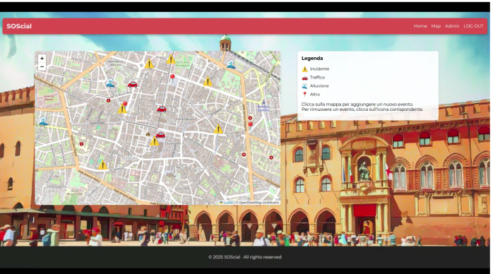
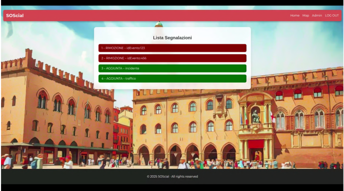
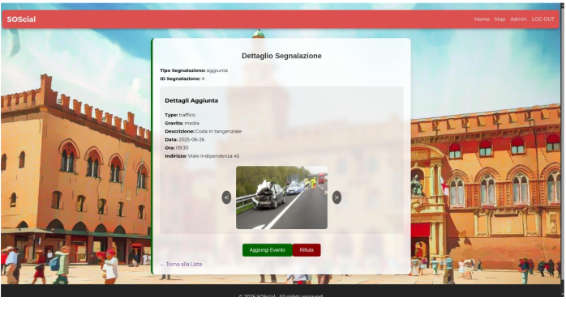

# SOScial - Prototipo di Social Reporting

SOScial è un prototipo di applicazione desktop/web per la **segnalazione e gestione di eventi e pericoli in città**, sviluppato in **React** e con i dati memorizzati in **file XML**.  

L'obiettivo è fornire un'interfaccia semplice per **utenti e amministratori**:  

- Gli utenti possono segnalare eventi (danni, pericoli, disagi urbani).  
- Gli amministratori possono **approvare** o **eliminare** le segnalazioni, trasformandole in eventi attivi.  

---

## Tecnologie

- **Frontend:** React.js  
- **Gestione dati:** file XML (`reports.xml`, `events.xml`)  
- **Mappe:** Leaflet per visualizzare eventi sulla mappa   

---

